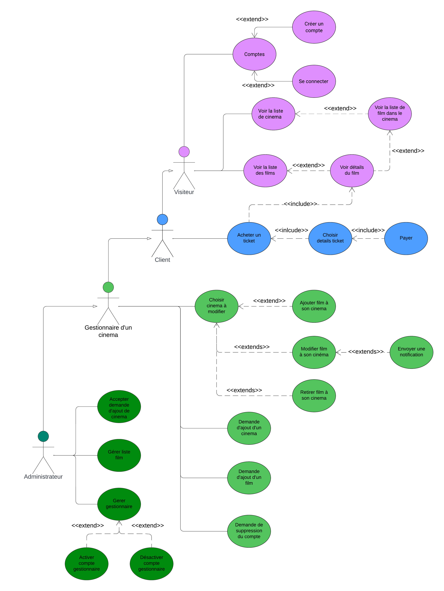

 Le diagramme représente les quatre types d'utilisateurs qui peuvent utiliser le service. Le diagramme possède une hiérarchie qui montre que plus que l'utilisateur est bas le plus il a de privilège. 

#### Quelque précision:

- Les visiteurs peuvent visionner le site web mais ne peuvent pas acheter des billets.
- Pour qu'un account soit considéré un gestionnaire, un administrateur doit l'accepter.

